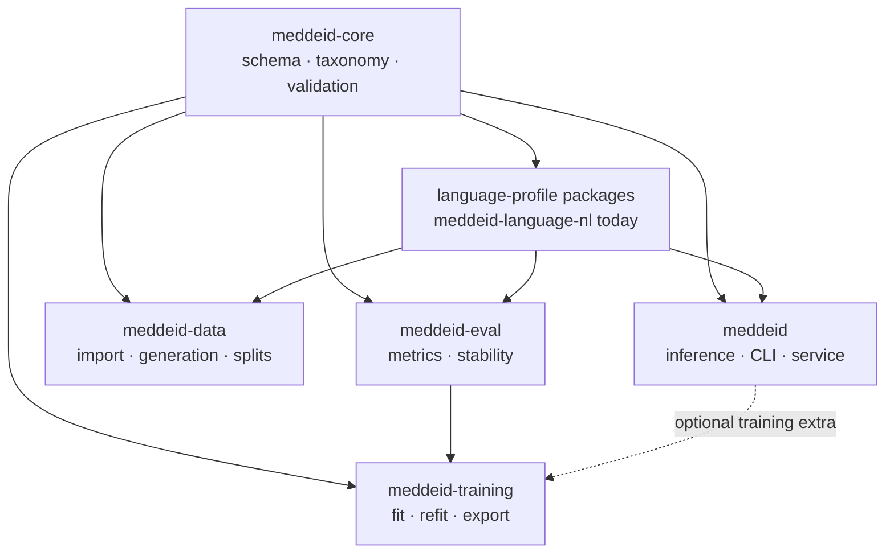
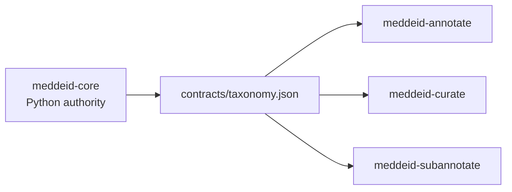

# Suite architecture

MedDeID is a language-extensible family of independently versioned repositories, not a runtime monorepo. Each package has one responsibility and declares every dependency it needs. The current public model and language package support Dutch, while the shared contracts and workflows are designed for additional languages.

## Dependency direction

The three browser applications consume generated copies of the core taxonomy contract. They do not define an alternative schema.

## Layers

| Layer | Components | Owns |
|---|---|---|
| Contract | `meddeid-core` | Record shape, taxonomy, offsets, normalization, validation |
| Language | `meddeid-language-*` packages | Language rules, locale profiles, and versioned resources |
| Runtime | `meddeid` | Model loading, tokenization, decoding, post-processing, local serving |
| Data | `meddeid-data` | Source import, stable identities, splits, synthetic generation |
| Human review | `meddeid-annotate`, `meddeid-curate`, `meddeid-subannotate` | Primary annotation, optional reconciliation, benchmark subannotation |
| Experiment | `meddeid-training`, `meddeid-eval` | Training protocol, export, metrics, stability |
| Artifacts | Hugging Face and Zenodo repositories | Published model, datasets, guidelines, checksums |

## Boundaries that matter

### Language-neutral core

`meddeid-core` has no language-specific rules and no model runtime. Language behavior belongs in separate profile packages, so a new language can implement the same provider interface without forking the schema, annotation tools, training flow, or evaluation contract.

The first implementation is `meddeid-language-nl`, which provides Dutch rules
and the `nl-BE` profile. A future language should live in its own independently
versioned package, register its Python profile provider and any JavaScript
subannotation profiles, package shared resources with provenance, and be pinned
by the corresponding model and evaluation bundles.

### Inference is small by default

Installing `meddeid` does not install data generation, training, evaluation, or annotation tools. The optional server dependency adds HTTP serving but not the research pipeline.

### Human workflows exchange files

The browser applications are local tools connected by canonical files and manifests. Curation is optional, and subannotation begins only from completed primary gold.

Subannotation has a language-neutral review engine and a built-in neutral
profile. Installed `meddeid-language-*` packages may additionally expose a
versioned semantic subannotation capability. The capability owns language and
locale grammar, category suggestions, formatting policy, and attributed lookup
resources; the application continues to own offsets, persistence, review state,
rebasing, validation, and export. Profile identity, ruleset version, resources,
and implementation hash are pinned in the resulting benchmark manifest.

JavaScript language packages self-register profile selections through
`package.json#meddeid.subannotationProfiles`; `meddeid-subannotate` discovers
that metadata without language-specific branches. Each workspace persists one
selection in `data/subannotation-profile.json`. Environment variables are
temporary overrides, not the normal configuration mechanism. Switching a
profile after review begins requires a backed-up migration that resets review
state.

Python and JavaScript capabilities may ship from the same language repository
and consume the same versioned resource files. This avoids copying locale
lookups between inference, generation, and subannotation while keeping their
runtime contracts separate.

### External comparators stay external

Belgian DEDUCE and other comparison systems run in their own environments. Only their canonical output crosses into `meddeid-eval`; their code and licence do not enter the MedDeID dependency graph.

### The suite workspace is a coordinator

The grouped `meddeid-suite` checkout assembles and verifies release candidates. End users clone or install individual components. Runtime code must not discover sibling source checkouts.
