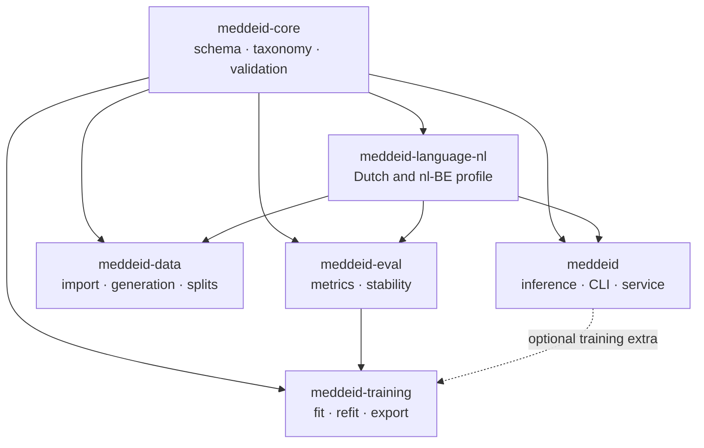
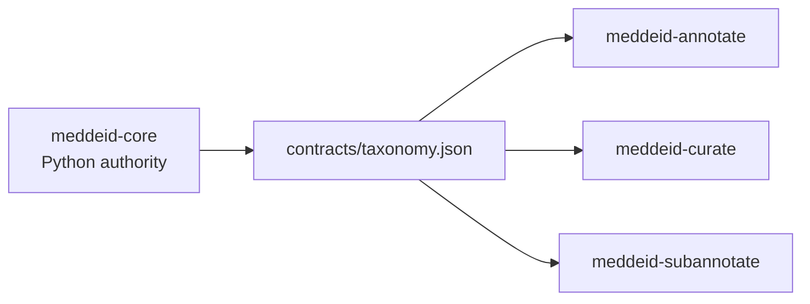

# Suite architecture

MedDeID is a family of independently versioned repositories, not a runtime monorepo. Each package has one responsibility and declares every dependency it needs.

## Dependency direction

The three browser applications consume generated copies of the core taxonomy contract. They do not define an alternative schema.

## Layers

| Layer | Components | Owns |
|---|---|---|
| Contract | `meddeid-core` | Record shape, taxonomy, offsets, normalization, validation |
| Language | `meddeid-language-nl` | Dutch rules, `nl-BE` profile, locale resources |
| Runtime | `meddeid` | Model loading, tokenization, decoding, post-processing, local serving |
| Data | `meddeid-data` | Source import, stable identities, splits, synthetic generation |
| Human review | `meddeid-annotate`, `meddeid-curate`, `meddeid-subannotate` | Primary annotation, optional reconciliation, benchmark subannotation |
| Experiment | `meddeid-training`, `meddeid-eval` | Training protocol, export, metrics, stability |
| Artifacts | Hugging Face and Zenodo repositories | Published model, datasets, guidelines, checksums |

## Boundaries that matter

### Language-neutral core

`meddeid-core` has no Dutch rules and no model runtime. Language behavior belongs in a separate profile package so another language can implement the same provider interface without forking the schema.

### Inference is small by default

Installing `meddeid` does not install data generation, training, evaluation, or annotation tools. The optional server dependency adds HTTP serving but not the research pipeline.

### Human workflows exchange files

The browser applications are local tools connected by canonical files and manifests. Curation is optional, and subannotation begins only from completed primary gold.

### External comparators stay external

Belgian DEDUCE and other comparison systems run in their own environments. Only their canonical output crosses into `meddeid-eval`; their code and licence do not enter the MedDeID dependency graph.

### The suite workspace is a coordinator

The grouped `meddeid-suite` checkout assembles and verifies release candidates. End users clone or install individual components. Runtime code must not discover sibling source checkouts.
