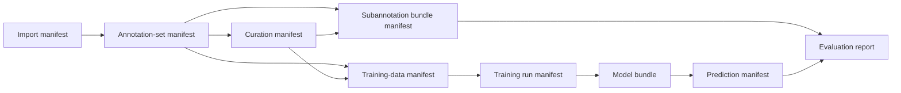

# Artifact lineage

Canonical JSONL carries the content. Manifests carry its identity, contracts, and ancestry.

## Identity levels

| Identity | Meaning | Stability rule |
|---|---|---|
| `document_id` | One source document in a project revision | Derived pseudonymously from project namespace and source ID |
| `annotation_set_id` | One completed reviewer submission | Declared in its manifest; bare files use transitional content identity |
| `span_id` | One labeled half-open range | Derived from document ID, `[begin,end)`, and label |
| SHA-256 | Exact bytes of an artifact | Any byte change produces a new hash |
| Model revision | Immutable published model snapshot | Pin a Hub commit SHA or local bundle checksum |

Sorting records does not change their document identity, but it does change the file hash. Moving or reordering source files does not change document identities when they are imported into the same project with the same source IDs.

## Annotation-set manifest

A durable reviewer submission records:

```json
{
  "manifest_version": "meddeid.annotation-set.v1",
  "annotation_set_id": "hospital-a-round-1",
  "status": "completed",
  "annotator_id": "reviewer-7",
  "contracts": {
    "schema_version": "meddeid.schema.v1",
    "offset_unit": "unicode_codepoints",
    "taxonomy_contract_version": 1,
    "taxonomy_version": "ProductionLabels-v1.1"
  },
  "files": {"annotations": "reviewer-a.jsonl"},
  "hashes": {"annotations_sha256": "<sha256>"}
}
```

Consumers verify the declared file, hash, completion state, and contracts before reading annotations.

## Handoff chain



Each child should identify its direct inputs by checksum. This produces a chain that can be audited without copying private source records into public metadata.

## Corrections

Correct a primary annotation at its source and republish the current canonical `annotations.jsonl`. `meddeid-subannotate` detects the changed hash, previews which subannotation work can be preserved, and requires renewed review where boundaries or meaning changed.

Do not:

- edit a downstream checksum to make a changed file appear unchanged;
- use filenames as durable annotation-set identity;
- overwrite an existing non-empty training or prediction output silently;
- publish local source-ID mappings or project HMAC keys;
- cite a moving model name without recording its immutable revision.

## Reproducible result package

At minimum, preserve the gold and prediction manifests, model revision or local checksum, package versions, language-profile manifest, evaluation configuration, metric output, and the command used to produce it. Store protected source data separately under its governing access controls.
