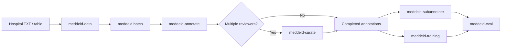

# Clinical de-identification that stays under your control

MedDeID is an open-source suite for detecting and removing identifying information from Dutch clinical text. Run inference locally, prepare and review datasets, adapt the model to a new domain, and evaluate the result with one shared data contract.

[Run your first note](start/quickstart.md){ .md-button .md-button--primary }
[Understand the suite](concepts/architecture.md){ .md-button }

!!! warning "De-identification is not a guarantee of anonymity"
    Validate MedDeID on representative data from your setting. Use human review and institutional controls whenever a missed identifier could expose sensitive information.

## Start with your goal

### De-identify text

Install one package and process a note locally with the published Dutch model.

[Start inference →](workflows/inference.md)

### Prepare and annotate data

Import TXT, CSV, TSV, or Parquet; create stable document identities; and review primary PII spans.

[Prepare a project →](workflows/prepare-and-annotate.md)

### Adapt or train a model

Turn reviewed development data into pinned training views and export a self-contained bundle.

[Follow the training path →](workflows/train-and-evaluate.md)

### Evaluate a system

Score MedDeID or an external comparator against the same canonical benchmark.

[Evaluate predictions →](workflows/train-and-evaluate.md#evaluate-predictions)

## One contract across the suite

Every stage exchanges canonical JSONL with stable `document_id` values, source text, and half-open Unicode-code-point spans. Manifests add hashes, versions, and lineage without changing that record shape.

## Public model and datasets

The current model, synthetic development corpus, and independent synthetic benchmark are collected on [Hugging Face](https://huggingface.co/collections/stighellemans/meddeid). Patient text is processed locally during normal package use; downloading a model is the only network step unless you deliberately use a hosted service.

[See all public artifacts](artifacts/index.md)
