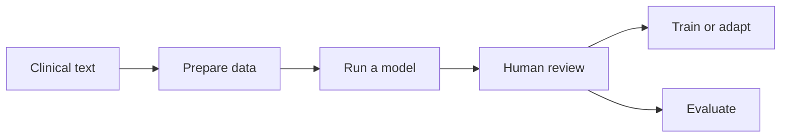

# Clinical de-identification that stays under your control

MedDeID is an open-source, language-extensible suite for detecting and removing identifying information from clinical text. Run it locally, prepare and review datasets, adapt a model to a new domain or language, and evaluate the result with tools designed to work together.

[Run your first note](start/quickstart.md){ .md-button .md-button--primary }
[Understand the suite](concepts/architecture.md){ .md-button }

!!! warning "De-identification is not a guarantee of anonymity"
    Validate MedDeID on representative data from your setting. Use human review and institutional controls whenever a missed identifier could expose sensitive information.

## Start with your goal

### De-identify text

Install one package and process a note locally. The current public model supports Dutch clinical text.

[Start inference →](workflows/inference.md)

### Prepare and annotate data

Import TXT, CSV, TSV, or Parquet files and review the identifiers in each document.

[Prepare a project →](workflows/prepare-and-annotate.md)

### Adapt or train a model

Use reviewed data to train or adapt a model that can be run locally.

[Follow the training path →](workflows/train-and-evaluate.md)

### Evaluate a system

Measure MedDeID or another system against the same reviewed test data.

[Evaluate predictions →](workflows/train-and-evaluate.md#evaluate-predictions)

## One workflow, adaptable to more languages

MedDeID connects the full journey from preparing clinical text to reviewing annotations, training models, and evaluating results. You can use the complete workflow or only the parts your project needs.

The current public model supports Dutch. New language models and language-specific rules can be added while reusing the same annotation, training, and evaluation tools.

For the technical details, see the [suite architecture](concepts/architecture.md) and [data contract](concepts/data-contract.md).

## Public model and datasets

The current model, synthetic development corpus, and independent synthetic benchmark are collected on [Hugging Face](https://huggingface.co/collections/stighellemans/meddeid). Patient text is processed locally during normal package use; downloading a model is the only network step unless you deliberately use a hosted service.

[See all public artifacts](artifacts/index.md)

Open collaboration

## Help bring MedDeID to more languages

We want to work with hospitals, care organizations, research groups, language experts, and open-source engineers. Local clinical knowledge, representative validation, language resources, annotation expertise, and technical contributions can help MedDeID support new languages responsibly.

[Discuss a collaboration](mailto:stig.hellemans@uantwerpen.be){ .md-button .md-button--primary }
[Ways to contribute](project/contributing.md){ .md-button }

Please do not send patient text or other sensitive data by email.

