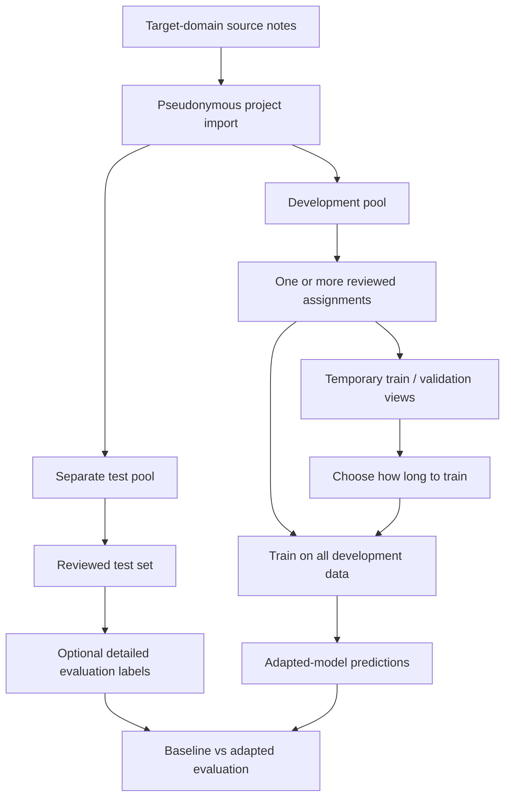

# Domain adaptation

Domain adaptation adds reviewed notes from the target setting while preserving an independent test set for the final comparison.

## Recommended design

Training and validation are temporary parts of one development pool. After choosing how long to train, combine all development data and restart from the initial model. Do not add the test set to development data.

## Minimum sequence

1. Import target-domain notes with `meddeid-data project create`.
2. Choose the development and test groups before annotation, and do not move records between them later.
3. Generate baseline predictions once with a fixed model version.
4. Keep an unchanged copy of the test predictions for baseline scoring.
5. Review development notes; independently review test notes when the protocol calls for it.
6. Optionally curate the test annotations and add detailed evaluation labels.
7. Build `selection` and `refit` views with `meddeid-data project prepare-training`.
8. Select epochs, refit, and export with `meddeid-training`.
9. Run the adapted bundle on the same sealed test records.
10. Score baseline and adapted predictions with the same `meddeid-eval` version and gold file.

## Decisions to document before starting

- intended clinical setting and document types;
- definition of PII and the annotation labels;
- development/test split method and seed;
- whether reviewers see model pre-annotations;
- whether test review is single, double, or adjudicated;
- model version used for initialization and baseline scoring;
- primary and secondary metrics;
- stopping and exclusion rules;
- governance boundary for source text and derived artifacts.

## Avoid misleading conclusions

A handful of notes can test the interfaces and handoffs, but cannot establish adaptation effectiveness. Choose sample sizes and uncertainty analyses for the intended claim. Report both missed PII and unnecessary redaction; exact-span F1 alone does not describe privacy risk.

The suite workspace contains a small synthetic pilot for checking that the workflow runs. Treat it as an executable example, not evidence of model quality.
